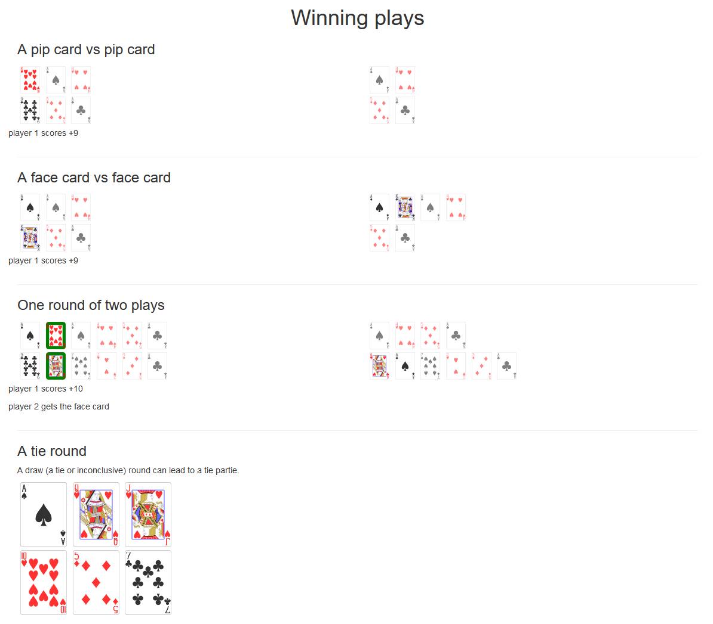

# *Outscore* Card Game

*Outscore* Card Game is a novel card game out of my imagination. I believe most viable and loved card games have these properties:

Before diving in, you can join me on Slack for discussion and further explanations 

*Outscore* is an old English word meaning: to entertain or enjoy oneself; to display happiness or joy.

- Easy to learn rules and an intuitive goal
- Open possibilies for endless fun and also skills improvement 
- Luck assures: 
    - An entertaining party.
    - Players cannot predict definitely a win at anytime in a party.
- The game uses common and cheap tools (like the standard 52-card deck, domino tiles, stones and sticks, etc.).

## Properties and goals of *Outscore*

### A Trick-taking games

The object of a trick-taking game is based on the play of multiple rounds, or tricks, in each of which each player plays a single card from their hand, and based on the values of played cards one player wins or "takes" the trick. The specific object varies with each game and can include taking as many tricks as possible, taking as many scoring cards within the tricks won as possible, taking as few tricks (or as few penalty cards) as possible, taking a particular trick in the hand, or taking an exact number of tricks. Bridge, Whist, Euchre, 500, Spades, and the various Tarot card games are popular examples. [Wikipedia]

## Goal

- The goal in *Outscore* is to simply have the biggest accumulated score (sum) at the end of a party. It is a mix of luck, feeling and reflexion; In other words: Two exposed hands at game start cannot conclude the winner but can say one seems to be luckier.

- To understand the "win propertie" before diving into rules, let's imagine the game is 100% chance; Assuming this, having two hands and before diving into game-play, We can conclude scores like the following:

We sum and compare two hands simply with these weights: `Ace->1, Jack->2, Queen->3, King->4, 2->2, ..., 10->10`.

The hand with the biggest sum is the winner. Easy! Rules in fact are as easy as this but but brings more entertainment to the game :) ; Just follow up with me.

## Rules, game-play and strategy:

### Codification and language:

To ease our Latin language and for possible machine implementation, let's set the following language:

`P_i` is player i for example P_1 is player 1

`Cd_Num` is one card in {1, 2, 3, 4, 5, 6, 7, 8, 9, 10} cards no matter the suits: clubs (♣), diamonds (♦), hearts (♥) or spades (♠).

`Cd_Face` is one card in {Ace, Jack, Queen, King} cards no matter the suits: clubs (♣), diamonds (♦), hearts (♥) or spades (♠).

`P_i::Cd` is player i playing a card. It is one move (facing up a card) of the two opponents move either at one time or one after the other.
`P_i::Cd` is one of two types of plays: `{P_i::Cd_Num, P_i::Face}`.

`[P_i::##, P_j::##]` is a one play (two players moves). For example: 
- `[P_1::Cd_Num, P_2::Cd_Face]` is a play with player 1 playing `Cd_Num` and player 2 playing `Cd_Face`.
- `[P_1::Cd_Num*, P_2::Cd_Face*]` is a list of plays with player 1 playing only `Cd_Num` cards and player 2 playing only `Cd_Face` cards in a one ongoing round.

`Round_i` is the i(th) round, (first, second, ...). A Round determines one win for one player; The winner takes a plus score and the loser conserves his previous score (of `Round_(i-1)`).

`Score_i` is a score that goes to the winner after `Round_i`.

`P_i_Score` is the accumulated score for player i; ie: The cumulative sum of `[Score_0, Score_1, ..., Score_i]`.

*A "round" can be more than two "plays".*

We will explain a "round" in a two opponents version in the following section **Rules and Game-play**

### Rules and game-play

***This is the two opponents version of Outscore***

*Outscore* is played progressively while marking down accumulated scores in one visible paper where each player has his current score. 

Example:

| rounds  | Player 1 | Player 2 |
|---------|----------|----------|
| Round 1 | 2        | 0        |
| Round 2 | 2        | 3        |
| Round i | 3        | 3        |
| Round n | 13       | 8        |

The game starts with two hands for each player, say 10 cards for each. Players choose *sequentially* or *simultaneously* one card from hand and face it up one after the other.

A one round can be one of the followings:

- `[Pi::Cd_Num, Pj..Cd_Num]` is a one play round with the *lowest Number* added to the opponent score *while cards go to the table.*
- `[Pi::Cd_Face, Pj..Cd_Face]` is a one play round with the *lowest Face card* goes to the opponent hand *and not to the table.*
- *Remaining Face cards* in hands in the *final round* are scored with their values as `Ace->1, Jack->2, Queen->3, King->4`
- `[Pi::Cd_Num, Pj..Cd_Face]` or `[Pi::Cd_Face, Pj..Cd_Num]` are not sufficient for a round unless it is the last possible play; It is then the last round. Otherwise another play is needed: This is a tie play and the round is not dealt.
- A round with more than one play is critical. To win, we only compare `Cd_Face` and `Cd_Num` for each player respectively face to face and number to number; With the *lowest this time* `Cd_Face` winning the *highest single*  `Cd_Face` card *going to the winner's hand* and the *highest* `Cd_Num` single card winning the *lowest* `Cd_Num` *going to the winner's score*. In this case, It is never a win round but 
    - A win of `Cd_Num` scores to one player and 
    - A win of `Cd_Face` to the other.
- A round with `[P_i::Cd_Num*, P_j::Cd_Face*]` is a tie. Symetrically `[P_i::Cd_Num*, (P_j::Cd_Face*, P_i::Cd_Num)]` or `[P_i::Cd_Face*, (P_j::Cd_Num*, P_i::Cd_Face)]` is no longer a tie.
- If it is a tie play (`[P_i::Cd_Num*, P_j::Cd_Face*]`) and there are no more cards in hands for at least one player, it is still a tie round (`Round_n`). It is a final tie round and score is maintained (`Round_n-1`) plus scoring only face cards.
- Rounds yield to many face cards each players hand because they are never put on table but remain in hands; Face cards are never scored until the final round as stated before. 
- Long rounds can be seeked by one player strategy to keep current score until a tie final round.
- Because face cards are never scored until the final round, in the progress, they are used strategically for clever moves (to maintain or to end a tie round) but also for their final score.

#### Round state machine

### Round rules

Because game-play is a successive set of rounds, there is a crucial question to address; Who plays each round first ?

- If we think opponents faces up cards at the same time, there is a lot more chance in this game than strategy.
- If we think one opponent faces up a card after the other, there would be multiple approaches; For example the last round loser would start first or last (punish more or give him a little advantage to come back stronger).
- I think the best option is to give each round some chance and also space for strategy. Here is how It goes in *Outscore*:
    - Player A comes first with whatever card and player B must declare He is either coming after with a `Cd_Face` or a `Cd_Num` card. Player A builds strategy on what Player B type of card is coming, and Player B builds strategy limited on one type of cards on Player A first move.
    - Now when does Player A / B come first ? I do not know, I think of the following: In the beginning of game-play, Player A / B comes first based on a coin flip or friendly declaration, then round after round, probably the loser of `Round_i` would go first ? 

## Strategy

 - For each play, in each round, (at any moment of game-play) a player feels He will be winning and tries to maximize score, or feels He will be losing and tries to lower the score for the current round or for the whole game party.
 - One strategy for player A is to feel the growing greed of player B; When player B is becoming greedy He may want to come up with big scoring cards; Player A would absorb the push by coming up with low cards.
 - When player A feels winning the game and wants to maintain the current score, He may want to continue plays yielding a tie round; With the risk of losing a lot !

- That is version 0. Please raise any issue for any *ambiguity* or *indeterminacy* or even a *better approach*.
